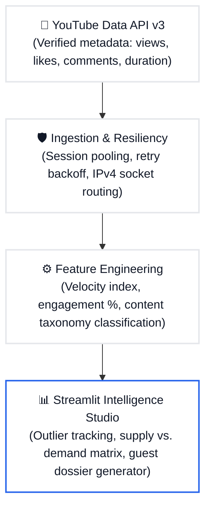

# 🎙️ Figuring Out — Content & Guest Intelligence Studio

An end-to-end data analytics and research briefing engine built for **Figuring Out Media**. This system ingests verified episode metrics, identifies high-velocity content gaps, and automates pre-interview guest intelligence dossiers.

---

## 📌 Executive Summary

Modern creator-media companies scale through data-informed editorial decisions and rapid guest briefing workflows. This engine delivers two core capabilities:
1. **Content Intelligence & Gap Analysis:** Identifies asymmetric demand verticals where audience engagement outpaces episode supply.
2. **Automated Pre-Interview Briefing:** Generates structured guest research dossiers, high-friction question arcs, and short-form hook angles in seconds.

---

## 🏗️ Architecture Pipeline



---

## 🔍 Key Data Findings (60+ Analyzed Episodes)

* **Asymmetric Supply Gap:** While **Geopolitics & Defense** represents the highest volume of uploads (~36%), **Health, Science & Mind** commands the highest average views (~1.59M) and peak engagement (2.55%) with only ~5% of episode inventory.
* **Velocity Drivers:** Episodes anchored in human behavior, contrarian macro forecasts, and elite domain mastery accumulate views per day significantly faster than generic lifestyle interviews.

---

## 🚀 Installation & Local Setup

### 1. Clone the repository
```bash
git clone [https://github.com/Shraddha-1214/figuring-out-content-intelligence.git](https://github.com/Shraddha-1214/figuring-out-content-intelligence.git)
cd figuring-out-content-intelligence
```

### 2. Environment Setup
```bash
python -m venv venv
# Windows:
venv\Scripts\activate
# macOS/Linux:
source venv/bin/activate

pip install -r requirements.txt
```

### 3. API Key Configuration
Create a `.env` file in the root directory:
```env
YOUTUBE_API_KEY=your_youtube_data_api_v3_key
```

### 4. Ingest and Process Data
```bash
python src/fetch_data.py
python src/process_features.py
```

### 5. Launch the Dashboard
```bash
streamlit run app.py
```

---

## 🛠️ Tech Stack
* **Language & Analysis:** Python, Pandas, NumPy
* **API Ingestion:** YouTube Data API v3, Requests, Urllib3
* **Visualization & Interface:** Streamlit, Plotly Express
